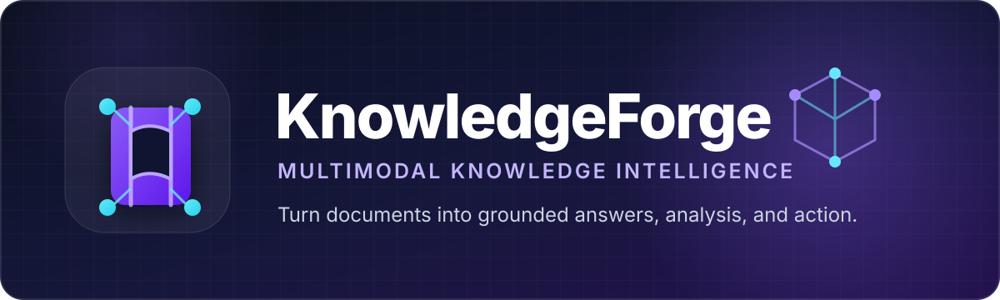
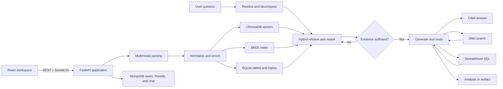

<!-- markdownlint-disable MD013 MD033 MD041 -->

<p align="center">
  
</p>

<p align="center">
  <strong>A local-first, multimodal intelligence workspace for turning complex document collections into grounded answers, structured analysis, and decision-ready artifacts.</strong>
</p>

<p align="center">
  <a href="https://www.python.org/"></a>
  <a href="https://fastapi.tiangolo.com/"></a>
  <a href="https://react.dev/"></a>
  <a href="https://www.langchain.com/langgraph"></a>
  <a href="LICENSE"></a>
</p>

<p align="center">
  <a href="#why-knowledgeforge">Why KnowledgeForge</a> ·
  <a href="#capabilities">Capabilities</a> ·
  <a href="#how-it-works">Architecture</a> ·
  <a href="#quick-start">Quick start</a> ·
  <a href="#configuration">Configuration</a> ·
  <a href="PRODUCT.md">Product overview</a> ·
  <a href="docs/PROJECT_REFERENCE.md">Project reference</a>
</p>

---

KnowledgeForge—internally developed as **PRISM**—is more than a “chat with PDF” application. It ingests heterogeneous files, builds a hybrid knowledge index, evaluates whether retrieved evidence is good enough, and routes each request through the right tool: grounded Q&A, web research, spreadsheet SQL, summarization, artifact creation, or deeper strategic analysis.

> [!IMPORTANT]
> KnowledgeForge is active, GPU-first research software. The local two-process workflow is the current reference setup. The repository contains container definitions, but they still need alignment with the current frontend proxy files before being treated as a production deployment path.

## Why KnowledgeForge

Most document assistants stop after retrieving a few semantically similar passages. KnowledgeForge is designed for messier, higher-value work: mixed file types, long collections, scanned pages, structured tables, multi-part questions, and outputs that need to become deliverables.

| Understand | Reason | Create |
| --- | --- | --- |
| Parse documents, slides, spreadsheets, images, markup, and scanned pages | Combine vector search, BM25, reciprocal-rank fusion, reranking, corrective retrieval, and query decomposition | Generate cited answers, mind maps, word clouds, analyses, roadmaps, reports, presentations, PDFs, and workbooks |

### What makes it different

- **Corrective RAG, not one-shot retrieval** — a LangGraph evaluator can reformulate and re-run weak retrieval before generation.
- **Hybrid evidence discovery** — ChromaDB semantic search and BM25 keyword search are fused, reranked with a cross-encoder, and diversified before prompting.
- **True multimodal ingestion** — native extraction, OCR, GLM-OCR, and a vision-language model work together on text, tables, formulas, figures, slides, and scanned pages.
- **Spreadsheet intelligence** — Excel and CSV data is loaded into SQLite so the agent can answer analytical questions with generated SQL.
- **Source-aware answers** — responses retain document/page evidence and web attribution, with confidence metadata.
- **From analysis to artifacts** — the same workspace can produce editable outlines, section revisions, DOCX/PDF/PPTX exports, and downloadable XLSX files.
- **Local-first model serving** — Ollama is the primary inference path; Gemini and OpenAI fallbacks are explicit, optional switches.
- **Thread-level control** — isolated workspaces, reusable documents, conversation context, and selectable custom instructions keep analysis organized.

## Capabilities

### Inputs

| Category | Supported formats | Processing highlights |
| --- | --- | --- |
| Documents | PDF, DOC, DOCX, RTF, TXT, EPUB, ODT, Markdown | Structural extraction, chunking, summaries, OCR/VLM enrichment |
| Presentations | PPT, PPTX | Slide text, embedded visual understanding, page-level citations |
| Spreadsheets | XLS, XLSX, CSV | Multi-sheet extraction, schema discovery, SQLite-backed querying |
| Images | JPG, JPEG, PNG, TIFF, BMP, GIF | EasyOCR, Tesseract, GLM-OCR, and vision-model analysis |
| Web/markup | HTML, XML | Text normalization and knowledge indexing |

### Intelligence studio

- Grounded chat across one or many documents
- Internal-only, external web-enhanced, self-knowledge, and conversational-context modes
- Document and collection-level summaries
- Interactive mind maps and word clouds
- Insight extraction and technical outlines
- Strategic roadmaps, technical roadmaps, strategic analysis, and technical analysis
- Natural-language spreadsheet analysis and Excel workbook generation
- Guided document creation with outline editing, section iteration, review, and version selection
- DOCX, PDF, PPTX, XLSX, Markdown, and HTML export paths
- Live progress through Socket.IO for uploads and long-running generation

## How it works



The query graph begins with retrieval, passes evidence through a corrective-RAG evaluator, and then lets the generation router decide whether to answer, search, query structured data, summarize, create an Excel artifact, or fall back to model knowledge. Complex questions can be split into parallel sub-queries and recombined into a single answer.

### System map

| Layer | Core technologies | Responsibility |
| --- | --- | --- |
| Experience | React, TypeScript, Vite, Tailwind, shadcn/ui, ReactFlow, Recharts | Authenticated workspaces, uploads, chat, citations, analysis modals, exports |
| API & realtime | FastAPI, Pydantic, Python Socket.IO | Authentication, thread/document APIs, orchestration, progress events |
| Agent | LangGraph, structured Pydantic outputs | Retrieval evaluation, routing, tool use, retries, multi-step synthesis |
| Retrieval | ChromaDB, Nomic embeddings, BM25, RRF, cross-encoder reranking, MMR | High-recall discovery with relevance and diversity controls |
| Document intelligence | Docling, PyMuPDF, python-pptx, openpyxl, Tesseract, EasyOCR, GLM-OCR, VLM | Parse and normalize multimodal source material |
| Persistence | MongoDB, SQLite, on-disk indexes | Users/threads, spreadsheet queries, entity triples, uploads, generated artifacts |
| Models | Ollama, optional Gemini/OpenAI fallback | Local structured inference with configurable cloud escape hatches |

## Quick start

### 1. Prerequisites

- **Python 3.11**
- **Node.js 22+** and npm
- **MongoDB** reachable from the machine running the backend
- **Ollama** for local inference
- **Tesseract OCR**; Poppler and Pandoc are recommended for broad document support
- An **NVIDIA CUDA GPU** is strongly recommended. The default embedding configuration targets CUDA.

Windows-specific installation screenshots and notes are available in [Windows_README.md](Windows_README.md).

### 2. Clone and install

```bash
git clone https://github.com/Fyxod/KnowledgeForge.git
cd KnowledgeForge

python -m venv .venv
```

Activate the environment:

```powershell
# Windows PowerShell
.\.venv\Scripts\Activate.ps1
```

```bash
# Linux / macOS
source .venv/bin/activate
```

Install both application layers:

```bash
python -m pip install --upgrade pip
pip install -r requirements.txt
python -m nltk.downloader stopwords

cd frontend
npm ci
cd ..
```

### 3. Configure the environment

```powershell
# Windows PowerShell
Copy-Item .env.example .env
```

```bash
# Linux / macOS
cp .env.example .env
```

At minimum, replace `SECRET_KEY`, confirm the MongoDB URL, and set `MAIN_MODEL` to a model available in Ollama. Cloud API keys may remain empty while their fallback switches are disabled.

Generate a strong application secret, for example:

```bash
python -c "import secrets; print(secrets.token_urlsafe(48))"
```

### 4. Prepare local models

The current defaults reference the following Ollama models:

```bash
ollama pull gpt-oss:20b
ollama create gpt-oss:20b-50k-8k -f scripts/model_oss
ollama pull gemma3:12b
ollama pull qwen3.5:9b
ollama pull glm-ocr:latest
ollama create glm-ocr-32k -f core/parsers/Modelfile.glm-ocr
```

The main query model is controlled by `MAIN_MODEL`; visual and OCR model names are currently defined in [`core/constants.py`](core/constants.py).

### 5. Run the services

Start MongoDB, then run two Ollama endpoints so query generation and visual parsing do not compete for the same queue.

```powershell
# Terminal 1 — query model endpoint
$env:OLLAMA_HOST="0.0.0.0:11434"
$env:OLLAMA_KEEP_ALIVE="-1"
ollama serve
```

```powershell
# Terminal 2 — vision/OCR endpoint
$env:OLLAMA_HOST="0.0.0.0:11435"
$env:OLLAMA_KEEP_ALIVE="-1"
ollama serve
```

Then start the application:

```bash
# Terminal 3 — backend
python backend.py
```

```bash
# Terminal 4 — frontend
cd frontend
npm run dev
```

Open **[http://localhost:8080](http://localhost:8080)**. The API runs at **[http://localhost:8000](http://localhost:8000)**, its OpenAPI UI is at **[http://localhost:8000/docs](http://localhost:8000/docs)**, and the health endpoint is **[http://localhost:8000/health/](http://localhost:8000/health/)**.

## Configuration

The environment templates are [`.env.example`](.env.example) and [`.env.docker`](.env.docker). Never commit a populated `.env` file.

| Variable | Purpose | Typical local value |
| --- | --- | --- |
| `DATABASE_URL` | MongoDB connection string | `mongodb://localhost:27017` |
| `DATABASE_NAME` | Application database | `bedrock` |
| `SECRET_KEY` | JWT signing secret | A unique, randomly generated value |
| `MAIN_MODEL` | Primary structured-generation model | `gpt-oss:20b-50k-8k` |
| `LOCAL_BASE_URL` | Base host for local Ollama clients | `http://localhost` |
| `QUERY_URL`, `VISION_URL` | Remote inference endpoints when `REMOTE_GPU=True` | Deployment-specific URLs |
| `REMOTE_GPU` | Use remote model endpoints instead of local Ollama | `False` |
| `USE_VISION_MODEL` | Enrich pages/slides with VLM parsing | `True` |
| `TAVILY_API_KEY` | Enables External-mode web search | Empty for document-only use |
| `GEMINI_API_KEYS` | Optional Gemini fallback key pool | `[]` |
| `OPENAI_API_KEY` | Optional final LLM fallback | Empty |

Runtime capability switches—including corrective retrieval, decomposition, GLM-OCR, document creation, Excel generation, and cloud fallbacks—live in [`core/constants.py`](core/constants.py) and are exposed through the authenticated settings API.

### Privacy boundary

Local Ollama inference and the local indexes keep document processing on your machine by default. Two actions deliberately cross that boundary:

1. **External mode** sends search queries to Tavily.
2. Enabling **Gemini/OpenAI fallbacks** can send prompt context to those providers.

Keep those paths disabled for confidential collections. Before exposing the service beyond a trusted network, use a strong secret, restrict CORS, terminate TLS, review authentication/session handling, and place the API behind a hardened reverse proxy.

## Repository layout

```text
KnowledgeForge/
├── agent/                    # LangGraph state, nodes, routing, and tools
├── app/                      # FastAPI routes, auth middleware, Socket.IO
├── core/
│   ├── document_creator/     # Outline-to-DOCX/PDF/PPTX pipeline
│   ├── embeddings/           # Vector/BM25 retrieval and reranking
│   ├── excel_skill/          # Workbook planning, extraction, assembly
│   ├── llm/                  # Providers, prompts, schemas, output repair
│   ├── parsers/              # Multiformat, OCR, VLM, and GLM-OCR parsing
│   ├── services/             # Uploads, SQLite, entity triples
│   └── studio_features/      # Summaries, maps, insights, analyses, roadmaps
├── frontend/                 # React + TypeScript application
├── docs/                     # Deep technical reference and README assets
├── scripts/                  # Ollama and system setup helpers
├── backend.py                # Backend development entrypoint
└── frontend.py               # Cross-platform frontend launcher
```

Generated data is isolated beneath `data/{user_id}/threads/{thread_id}/`, with separate locations for original uploads, parsed content, indexes, mind maps, triples, and generated artifacts. The `data/` tree and `.env` are ignored by Git.

## Development

Useful validation commands:

```bash
# Python syntax/import compilation without starting external services
python -m compileall agent app core

# Frontend checks
cd frontend
npm run lint
npm run build
```

When changing agent behavior, keep prompts in `core/llm/prompts/`, structured response contracts in `core/llm/output_schemas/`, and model calls behind `core.llm.client.invoke_llm()` so retry, fallback, and output-repair behavior stays consistent.

For a detailed tour of routes, data flows, models, and conventions, read [`docs/PROJECT_REFERENCE.md`](docs/PROJECT_REFERENCE.md).

## Project status

KnowledgeForge already contains a broad end-to-end product surface, but it should currently be treated as an actively evolving research platform rather than a hardened hosted service. The most valuable next maturity steps are restoring automated backend coverage, reconciling the Docker/Nginx deployment files, pinning Python dependencies, and adding production security defaults.

Contributions that make the system easier to run, evaluate, and deploy are welcome. Please open an issue before large architectural changes so work can stay aligned with the agent and data model.

## License

KnowledgeForge is licensed under the [Apache License 2.0](LICENSE). You may use, modify, and distribute the code under its terms. Model weights, hosted APIs, and third-party dependencies remain subject to their respective licenses and terms.

---

<p align="center">
  <strong>Forge scattered information into usable knowledge.</strong>
</p>
