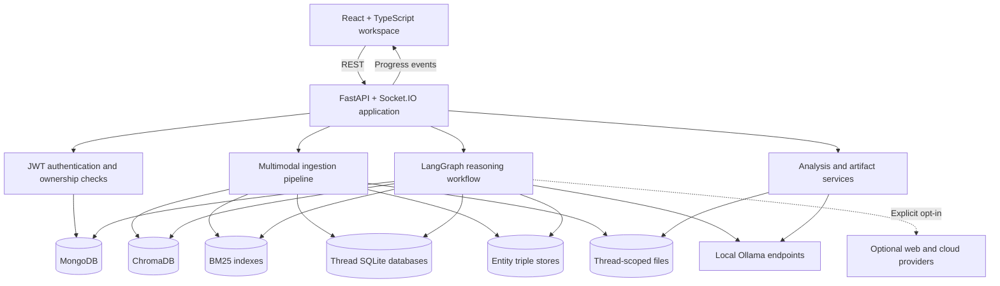
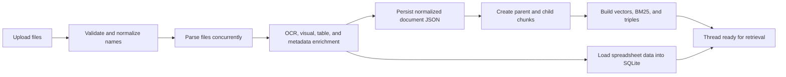
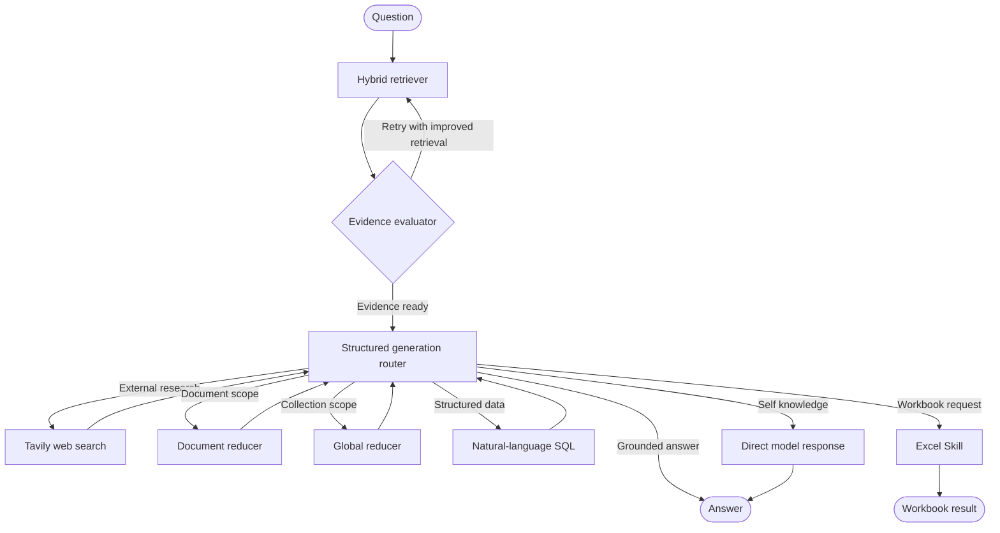
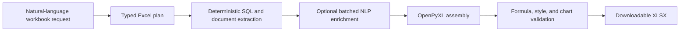
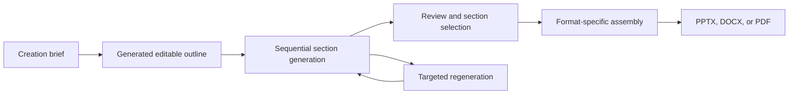

<!-- markdownlint-disable MD013 -->

# KnowledgeForge — Project Reference

> A source-aligned guide to the architecture, data flows, APIs, and extension points behind KnowledgeForge.

KnowledgeForge is a local-first multimodal intelligence platform for working with complex document collections. It unifies document ingestion, OCR and visual understanding, hybrid retrieval, corrective agent workflows, spreadsheet analysis, cited question answering, and artifact generation behind a React workspace and FastAPI service.

This reference explains how the current implementation fits together. For installation and the fastest path to a running workspace, start with the [main README](../README.md).

## Contents

1. [Product model](#product-model)
2. [Architecture at a glance](#architecture-at-a-glance)
3. [Repository map](#repository-map)
4. [Backend application](#backend-application)
5. [Document ingestion](#document-ingestion)
6. [Indexing and retrieval](#indexing-and-retrieval)
7. [Agentic query workflow](#agentic-query-workflow)
8. [Spreadsheet intelligence](#spreadsheet-intelligence)
9. [Document creator](#document-creator)
10. [Intelligence studio](#intelligence-studio)
11. [Model layer](#model-layer)
12. [Frontend application](#frontend-application)
13. [Persistence model](#persistence-model)
14. [Realtime progress](#realtime-progress)
15. [Authentication and isolation](#authentication-and-isolation)
16. [API reference](#api-reference)
17. [Configuration](#configuration)
18. [Local runtime](#local-runtime)
19. [Extension guide](#extension-guide)

## Product model

KnowledgeForge organizes work around authenticated users and persistent threads. A thread is more than a conversation: it is an isolated knowledge workspace containing documents, parsed content, indexes, spreadsheet tables, instructions, chat history, analyses, and generated artifacts.

The core workflow is:

1. Create a thread and upload one or more files.
2. Parse text, tables, images, slides, and page-level structure.
3. Build semantic, lexical, relational, and structured-data representations.
4. Ask questions in an internal, external, self-knowledge, or contextual mode.
5. Evaluate the available evidence and route the request through the appropriate reasoning path.
6. Return a grounded response with source metadata and confidence information.
7. Turn the same source collection into maps, analyses, roadmaps, reports, presentations, or workbooks.

### Primary capabilities

| Area | What KnowledgeForge provides |
| --- | --- |
| Multimodal understanding | Native extraction, OCR, visual-language analysis, table recovery, slide parsing, and scanned-page support |
| Knowledge retrieval | Hierarchical ChromaDB vectors, BM25 search, reciprocal-rank fusion, cross-encoder reranking, MMR diversity, and entity-relation context |
| Agentic reasoning | Query resolution, decomposition, corrective retrieval, web research, summarization, SQL analysis, and bounded routing in LangGraph |
| Spreadsheet analysis | Persistent SQLite tables, natural-language SQL, schema-aware reasoning, NLP enrichment, and generated XLSX workbooks |
| Structured creation | Mind maps, word clouds, insights, strategic and technical roadmaps, analyses, reports, presentations, PDFs, and Excel exports |
| Workspace continuity | Thread instructions, selected-document scope, chat context, reusable documents, versioned sections, and persistent generated files |

### Supported source formats

| Category | Extensions | Processing path |
| --- | --- | --- |
| Documents | PDF, DOC, DOCX, RTF, TXT, EPUB, ODT, MD | Structure-aware extraction, page normalization, OCR/VLM enrichment, hierarchical indexing |
| Presentations | PPT, PPTX | Slide text, tables, shapes, embedded images, visual enrichment, page-level evidence |
| Spreadsheets | XLS, XLSX, CSV | Header detection, multi-sheet schemas, Markdown representations, persistent SQLite tables |
| Images | JPG, JPEG, PNG, TIFF, BMP, GIF | EasyOCR, Tesseract, GLM-OCR, and visual-language interpretation |
| Markup | HTML, XML | Text normalization and standard knowledge indexing |

## Architecture at a glance



### Runtime topology

| Service | Default address | Role |
| --- | --- | --- |
| React development server | `http://localhost:5173` | Browser application |
| FastAPI application | `http://localhost:8000` | REST API, OpenAPI, and Socket.IO transport |
| MongoDB | `mongodb://localhost:27017` | Users, threads, documents, chats, and instructions |
| Query-model Ollama endpoint | `http://localhost:11434` | Main structured generation and reasoning |
| Vision/OCR Ollama endpoint | `http://localhost:11435` | Page, slide, image, and OCR model workloads |
| GLM-OCR SDK service | `http://localhost:5002` | Structured OCR execution when enabled |

The two Ollama endpoints separate conversational generation from visual parsing so ingestion and question answering can progress independently.

### Technology stack

| Layer | Technologies |
| --- | --- |
| Web experience | React 18, TypeScript, Vite, Tailwind CSS, Radix UI, React Router, TanStack Query, ReactFlow, Recharts |
| API and realtime | FastAPI, Pydantic, Python Socket.IO, Uvicorn |
| Agent orchestration | LangGraph, LangChain, typed agent state, structured output schemas |
| Document intelligence | Docling, PyMuPDF, python-pptx, python-docx, OpenPyXL, EasyOCR, Tesseract, GLM-OCR |
| Retrieval | ChromaDB, Nomic embeddings, BM25, reciprocal-rank fusion, cross-encoder reranking, MMR |
| Storage | MongoDB, SQLite, ChromaDB, pickle indexes, thread-scoped JSON and generated files |
| Model providers | Ollama by default, with independently configurable Gemini and OpenAI fallbacks |
| External research | Tavily web search in External mode |

## Repository map

```text
KnowledgeForge/
├── agent/
│   ├── builder.py                 # LangGraph topology
│   ├── graph_nodes.py             # Retrieval, generation, SQL, web, and summary nodes
│   ├── state.py                   # Typed workflow state
│   └── tools/                     # Query-time agent utilities
├── app/
│   ├── main.py                    # FastAPI and Socket.IO assembly
│   ├── middleware/                # JWT request authentication
│   ├── routes/                    # User, thread, query, upload, studio, and export APIs
│   └── socket/                    # Authenticated connection and progress management
├── core/
│   ├── document_creator/          # Outline-to-artifact creation workflow
│   ├── embeddings/                # Chunking, vector store, BM25, fusion, and reranking
│   ├── excel_skill/               # Typed workbook planning and deterministic assembly
│   ├── llm/                       # Clients, prompts, schemas, retries, and output repair
│   ├── parsers/                   # Format-specific extraction, OCR, and visual parsing
│   ├── services/                  # Upload, SQLite, and entity-triple services
│   └── studio_features/           # Summaries, maps, insights, analyses, and roadmaps
├── frontend/
│   ├── src/components/            # Workspace and reusable UI components
│   ├── src/pages/                 # Authentication, dashboard, and thread pages
│   └── src/services/              # API and realtime integration
├── docs/                          # Technical reference and visual assets
├── scripts/                       # Model and environment helpers
├── backend.py                     # Uvicorn development entrypoint
├── frontend.py                    # Cross-platform frontend launcher
└── requirements.txt               # Python dependencies
```

## Backend application

`app/main.py` builds the application in four layers:

1. Create the FastAPI application and configure CORS.
2. attach authentication middleware to protected API paths.
3. Include feature routers for users, threads, uploads, queries, studio tools, exports, and settings.
4. Wrap the application with `socketio.ASGIApp` for authenticated realtime events.

`backend.py` runs the resulting ASGI application through Uvicorn on port `8000`.

### Service organization

Routes are intentionally thin. They validate ownership and request data, then delegate substantial work to the relevant service:

- upload services own file placement and ingestion startup;
- parser modules own source-format normalization;
- embedding modules own chunking, indexing, and retrieval;
- graph nodes own reasoning and routing;
- studio services own structured analysis outputs;
- document-creator and Excel-skill packages own long-running artifact workflows.

This separation keeps HTTP transport, model orchestration, and deterministic file generation independently understandable.

### Typed contracts

Pydantic models are used throughout the backend for:

- authentication, thread, upload, and query requests;
- documents, chats, citations, and confidence metadata;
- structured LLM responses and routing decisions;
- mind maps, insights, roadmaps, and analyses;
- document outlines, section content, reviews, and export status;
- Excel plans, columns, styles, aggregations, and charts.

Model responses pass through shared parsing and repair behavior before feature code consumes them. This gives the frontend stable JSON contracts even when the underlying generation provider changes.

## Document ingestion

Uploads are stored beneath the authenticated user's thread. Each filename receives a short unique suffix to prevent collisions while preserving recognizability. The API then starts parsing and emits progress updates through Socket.IO.



### Concurrent processing

The ingestion coordinator processes files in batches and uses asynchronous concurrency within each batch. Long-running parsing therefore scales across a mixed upload instead of serializing every source. Document summaries are produced as background work after the normalized content is available.

### PDF pipeline

PDF parsing combines complementary extraction strategies:

- Docling produces structured, page-oriented Markdown;
- PyMuPDF exposes native text, images, and page rendering;
- table-aware prompts preserve row and column meaning;
- GLM-OCR adds structured recognition for dense or scanned content;
- visual-language parsing can enrich every page with figure, diagram, formula, and layout interpretation.

The result is stored as page-level normalized content so later citations can retain source and page context.

### Presentation pipeline

PowerPoint parsing walks slides and nested shapes recursively. It extracts:

- titles and text boxes;
- tables and grouped objects;
- embedded images and their OCR content;
- diagram-like structures and normalized visual descriptions;
- rendered slide context for visual-language enrichment.

This preserves both the textual and visual meaning of a deck rather than treating it as a flat text export.

### Word-processing pipeline

DOC and DOCX sources contribute paragraphs, tables, page artifacts, and embedded images. Embedded visual content passes through the image understanding path, while text and tables retain document-level metadata for retrieval.

### Spreadsheet pipeline

Excel and CSV ingestion detects headers, including multi-row headers, then flattens and de-duplicates column names. Each sheet receives:

- a normalized textual representation for retrieval;
- schema and sample metadata for planning;
- a persistent SQLite table for exact analytical queries.

### Image and OCR pipeline

Standalone images can combine EasyOCR, Tesseract, GLM-OCR, and visual-language analysis. Each engine contributes a different strength: rapid text recognition, broad OCR compatibility, structured visual transcription, and semantic interpretation.

## Indexing and retrieval

KnowledgeForge builds several complementary representations because no single retrieval strategy works equally well for prose, identifiers, tables, and multi-document collections.

### Hierarchical chunks

Documents are indexed with parent and child chunks:

| Chunk level | Default size | Overlap | Purpose |
| --- | ---: | ---: | --- |
| Parent | 1,500 characters | 150 characters | Preserve enough context for final reasoning |
| Child | 500 characters | 75 characters | Improve retrieval precision |

Child chunks are searched. The final context expands strong child matches back into their parent passages, combining fine-grained matching with coherent evidence.

### Context enrichment

Before embedding, chunks can include compact retrieval cues derived from their source:

- document keywords and page headings;
- adjacent-page context;
- named entities and entity profiles;
- extractive summaries;
- document, page, and source identifiers.

These cues improve recall without replacing the original page content used for answer generation.

### Semantic search

The vector index uses `nomic-ai/nomic-embed-text-v1.5` with normalized embeddings. Queries receive the `search_query:` prefix and indexed passages receive the `search_document:` prefix expected by the model. ChromaDB collections are isolated by user and thread.

### Lexical search

Each thread also owns a BM25 index. Lexical matching is particularly valuable for:

- exact terminology;
- product or project identifiers;
- acronyms and part numbers;
- names that embedding similarity may underweight.

### Fusion and reranking

The retrieval sequence is:

1. Run semantic and BM25 retrieval across the resolved query and any generated retrieval variants.
2. Combine ranked lists with reciprocal-rank fusion.
3. Apply quality gates and an adaptive candidate budget.
4. Rerank candidates with `cross-encoder/ms-marco-MiniLM-L-6-v2`.
5. Apply entity and keyword boosts.
6. Use maximal marginal relevance to reduce redundant passages.
7. Expand selected child chunks into parent context.
8. Preserve representation across relevant documents.

The cross-encoder uses GPU FP16 acceleration when available.

### Entity relationships

Ingestion extracts subject-relation-object triples and stores them in a thread-specific SQLite database. Query-time entity matching can inject related facts alongside retrieved passages, improving questions that depend on relationships spread across separate chunks.

## Agentic query workflow

The query engine is a bounded LangGraph state machine defined in `agent/builder.py` and implemented by nodes in `agent/graph_nodes.py`.



### State model

`AgentState` keeps the workflow explicit. Its main groups are:

| State group | Representative fields |
| --- | --- |
| Request context | user, thread, query, resolved query, original query, selected mode, thread instructions |
| Conversation | prior messages and contextualized question |
| Retrieval | chunks, sub-queries, retrieval queries, triple context, initial search results |
| Corrective RAG | evidence verdict, retrieval attempts, ambiguity and sufficiency status |
| Web research | search requirement, queries, results, attempt count |
| Spreadsheet reasoning | schema, SQL query, results, retries, batched answers, NLP summaries |
| Visual reasoning | visual answer, referenced pages, page-level evidence |
| Output | answer, used chunks, confidence level, action, next node |

### Query resolution and decomposition

Conversational requests can be resolved against prior thread messages before retrieval. Complex questions may be decomposed into focused sub-queries, processed in parallel, and recombined into one response. The original wording remains in state so the final answer stays aligned with user intent.

### Corrective retrieval

The evaluator classifies the evidence as sufficient, ambiguous, or insufficient. When useful, the graph reformulates and retrieves again, with a fixed attempt limit. This makes retrieval quality an explicit decision instead of assuming the first result set is adequate.

### Generation router

The structured generation node selects an action from a closed set:

- answer from grounded evidence;
- perform web search in External mode;
- summarize one document;
- summarize the full collection;
- query spreadsheet data through SQL;
- create an Excel workbook;
- use model knowledge when that mode is requested.

Each route either returns a terminal result or feeds new evidence back into generation.

### Long-context reduction

When full-document or collection context exceeds the model budget, KnowledgeForge uses a map-reduce strategy. Batches are summarized independently, then combined within the configured context window. The main model budget is based on a 128K-token context with an output reserve.

### Query-time visual reasoning

Questions that explicitly reference pages, slides, figures, diagrams, or other visual elements can trigger page rendering and VLM interpretation during retrieval. Visual evidence is then combined with textual chunks instead of relying solely on ingestion-time descriptions.

### Confidence and sources

Responses persist the chunks and external results that informed the answer. The output also carries a structured confidence level (`high`, `medium`, or `low`) so the UI can communicate the strength of the evidence path.

## Spreadsheet intelligence

Spreadsheet support has two complementary modes: conversational analysis and workbook creation.

### Persistent analytical database

Every spreadsheet-enabled thread receives a SQLite database at:

```text
data/{user_id}/threads/{thread_id}/sqlite/thread.db
```

CSV files and workbook sheets become sanitized SQL tables. An internal registry maps source documents and sheets to their generated table names. WAL mode supports durable access across requests, and the query route can reload spreadsheet metadata after a backend restart.

The schema supplied to the agent includes table names, column types, row counts, and representative samples. This helps generation choose exact columns and aggregations.

### Natural-language SQL

For analytical questions, the graph can:

1. recognize that structured data is required;
2. inspect the thread schema;
3. generate a SQL query;
4. execute it against the thread database;
5. repair and retry within a fixed limit when needed;
6. synthesize the result into a readable answer.

Large result sets can be processed in batches, with NLP theme extraction layered over deterministic rows when the question requires qualitative interpretation.

### Excel Skill

Workbook requests use a typed planning and assembly pipeline:



A plan can specify:

- SQL, formula, static, and NLP-derived columns;
- grouping and aggregation behavior;
- number formats, widths, freezes, filters, and styles;
- summary sheets and chart definitions;
- source tables and output ordering.

Deterministic extraction remains separate from generative enrichment, making the produced workbook both expressive and traceable.

## Document creator

The document creator turns a thread's source material into a guided, versioned deliverable rather than a single opaque generation call.

### Supported document types

- presentation;
- executive summary;
- technical report;
- research brief;
- project proposal;
- comparison report.

Requests can specify the audience, tone, content format, length, and source-document scope.

### Creation lifecycle



Each section uses source-aware hybrid retrieval plus rolling context from earlier sections. The pipeline carries terminology and style decisions forward, helping a long report read as one document. A user can edit the outline, regenerate a section, compare versions, select the preferred version, and approve the final structure before export.

Creation state, status, section versions, and exports live beneath the thread's `document_creator` directory. This makes long-running generation resumable and keeps every artifact connected to its source workspace.

## Intelligence studio

KnowledgeForge exposes focused studio tools alongside chat.

| Tool | Scope | Output |
| --- | --- | --- |
| Summary | Document or collection | Structured digest of the selected material |
| Mind map | Document or collection | Hierarchical JSON rendered interactively with ReactFlow |
| Word cloud | Thread content | Weighted terms with domain-aware filtering |
| Insights | Document or collection | Structured themes, observations, and evidence |
| Strategic roadmap | Document or collection | Goals, phases, initiatives, dependencies, and outcomes |
| Technical roadmap | Document or collection | Architecture-oriented milestones, components, and implementation sequence |
| Strategic analysis | Document or collection | Decision-focused structured analysis |
| Technical analysis | Document or collection | Engineering-focused structured analysis |

Structured Pydantic schemas keep these features directly renderable in the UI. Analysis views can also use frontend PDF and presentation libraries for portable exports.

## Model layer

All feature code uses the shared LLM client rather than calling a provider directly. This central layer handles:

- local and remote endpoint selection;
- structured-output parsing;
- retry and output-repair behavior;
- optional provider fallback;
- provider-specific request formatting;
- consistent logging and timing.

### Model roles

| Role | Current default |
| --- | --- |
| Main reasoning model | `MAIN_MODEL`, defaulting to `gpt-oss:20b-50k-8k` |
| Image parser | `gemma3:12b` |
| Visual-language model | `qwen3.5:9b` |
| Structured OCR model | `glm-ocr-32k` |
| Gemini fallback | `gemini-3-flash-preview` |
| OpenAI fallback | `gpt-4o-mini` |

The local query model uses port `11434`; visual and OCR workloads use port `11435`. Remote GPU URLs can replace local endpoints through configuration.

### Prompts and output schemas

Prompt templates live under `core/llm/prompts/`. Structured response contracts live under `core/llm/output_schemas/`. Keeping these concerns separate lets features evolve their instructions without weakening the typed boundary consumed by the rest of the application.

## Frontend application

The frontend is a React 18 and TypeScript single-page application built with Vite.

### Routes

| Route | Purpose |
| --- | --- |
| `/landing` | Product introduction |
| `/login` | Existing-user authentication |
| `/register` | Account creation |
| `/dashboard` | Authenticated thread workspace |
| `/dashboard/new` | New thread and upload flow |
| `/dashboard/threads/:threadId` | Persistent document and conversation workspace |
| `/dashboard/profile` | User profile |

The root route redirects into the appropriate application flow. An optional simulation page can be enabled through frontend configuration.

### Experience architecture

The dashboard combines:

- thread navigation and document management;
- upload progress and processing state;
- a mode-aware chat composer;
- streamed/realtime progress feedback;
- source and confidence presentation;
- selected thread instructions;
- studio feature dialogs;
- document-creator and Excel generation workflows.

TanStack Query manages server state, React Router manages navigation, and Socket.IO carries background progress. ReactFlow renders mind maps, while Recharts and export libraries support analysis visualization and portable artifacts.

### API configuration

`frontend/config.ts` defines the backend base URL and frontend feature flags. The development Vite server listens on port `5173`, and the standard local backend URL is `http://localhost:8000`.

## Persistence model

KnowledgeForge deliberately combines multiple storage engines, assigning each one the workload it handles best.

| Store | Responsibility |
| --- | --- |
| MongoDB | User profiles, authentication records, embedded threads, documents, chats, and instructions |
| ChromaDB | Persistent semantic vectors organized by user and thread |
| BM25 index | Thread-level lexical retrieval |
| SQLite thread database | Spreadsheet tables and exact analytical queries |
| SQLite triple store | Entity relationships extracted from documents |
| Filesystem | Uploads, parsed pages, images, feature state, generated documents, and workbook exports |

### Thread-scoped filesystem

The primary file layout is:

```text
data/{user_id}/
├── bm25/{thread_id}.pkl
├── triples/{thread_id}.db
└── threads/{thread_id}/
    ├── uploads/
    ├── parsed/
    ├── images/{document_id}/
    ├── sqlite/thread.db
    ├── mind_maps/
    ├── stop_words/
    ├── excel_exports/
    ├── document_creator/
    └── feature-specific analysis and roadmap outputs
```

The repository ignores the runtime `data/` tree, so local knowledge stores and generated artifacts remain outside version control.

### MongoDB document model

A user record contains identity and authentication data plus embedded thread summaries. Each thread records:

- its name and timestamps;
- uploaded and reusable documents;
- chat messages and source metadata;
- confidence information;
- saved custom instructions.

The filesystem and database share user and thread identifiers, creating a consistent ownership boundary across every persistence layer.

## Realtime progress

Socket.IO connections authenticate with the same JWT identity used by the REST API. The server tracks active connections, sends periodic heartbeats, and cancels heartbeat tasks during shutdown.

Long-running services publish namespaced events using user, thread, and feature identifiers. This lets the browser show precise progress for uploads, parsing, document creation, and other background generation without polling every internal stage.

## Authentication and isolation

Registration hashes passwords with bcrypt. Login returns an HS256 JWT signed with `SECRET_KEY`. Authentication middleware protects application routes while leaving registration and login accessible.

The authenticated identity is then applied consistently:

- thread reads and mutations validate ownership;
- document download routes are user- and thread-scoped;
- uploads write only within the authenticated workspace;
- vectors, BM25 indexes, triples, SQLite tables, and artifacts use the same user/thread namespace;
- Socket.IO connections validate the token before joining progress channels.

Local inference and local indexes form the default processing path. External web search and Gemini/OpenAI fallback are separate runtime switches, making cloud use an explicit capability choice.

## API reference

The live OpenAPI explorer is available at `http://localhost:8000/docs` when the backend is running.

### Health and settings

| Method | Path | Purpose |
| --- | --- | --- |
| `GET` | `/health/` | Service health check |
| `GET` | `/settings/switches` | Read runtime capability switches |
| `PUT` | `/settings/switches/{key}` | Update a supported switch |

### Users

| Method | Path | Purpose |
| --- | --- | --- |
| `POST` | `/user/` | Register a user |
| `GET` | `/user/{user_id}` | Read a user profile |
| `POST` | `/user/login` | Authenticate and receive a token |

### Threads, documents, and chat

| Method | Path | Purpose |
| --- | --- | --- |
| `POST` | `/thread/` | Create a thread |
| `GET` | `/thread/` | List the authenticated user's threads |
| `GET` | `/thread/{thread_id}` | Read a thread |
| `PUT` | `/thread/{thread_id}` | Update thread metadata |
| `DELETE` | `/thread/{thread_id}` | Delete a thread |
| `DELETE` | `/thread/{thread_id}/document/{doc_id}` | Remove a document from a thread |
| `POST` | `/thread/{thread_id}/documents/add-existing` | Reuse an existing document |
| `GET` | `/thread/{thread_id}/chats` | Read chat history |
| `DELETE` | `/thread/{thread_id}/chats/{chat_index}` | Delete one chat entry |
| `DELETE` | `/thread/{thread_id}/chats` | Clear chat history |

Thread instruction routes support listing, creating, updating, and deleting reusable instructions within a thread.

### Upload and query

| Method | Path | Purpose |
| --- | --- | --- |
| `POST` | `/upload/` | Upload and process documents |
| `POST` | `/query/` | Run the agentic query workflow |
| `GET` | `/data/{user_id}/threads/{thread_id}/uploads/{file_name}` | Download an owned source file |

### Studio features

| Feature | Document scope | Collection scope |
| --- | --- | --- |
| Summary | `POST /summary` | `POST /summary/global` |
| Insights | `POST /insights` | `POST /insights/global` |
| Strategic roadmap | `POST /strategic_roadmap` | `POST /strategic_roadmap/global` |
| Technical roadmap | `POST /technical_roadmap` | `POST /technical_roadmap/global` |
| Strategic analysis | `POST /strategic_analysis` | `POST /strategic_analysis/global` |
| Technical analysis | `POST /technical_analysis` | `POST /technical_analysis/global` |

Mind maps support generation and retrieval through `/mindmap/{thread_id}`. Word clouds are generated through `/wordcloud/{thread_id}`. Markdown and HTML export routes provide portable text representations.

### Document creator endpoints

The `/document-creator` API covers the complete workflow:

- create a job and generate an outline;
- read and update the outline;
- start section generation;
- inspect status and generated sections;
- regenerate or edit individual sections;
- select section versions;
- submit review decisions;
- assemble and download the final artifact.

### Excel Skill endpoints

The `/excel-skill` API supports:

- request creation;
- plan inspection and confirmation;
- asynchronous execution;
- status retrieval;
- workbook download.

## Configuration

Application environment settings are defined in `core/config.py`. Feature constants and runtime switches live in `core/constants.py`.

### Environment variables

| Variable | Description | Default or example |
| --- | --- | --- |
| `DATABASE_URL` | MongoDB connection URL | `mongodb://localhost:27017` |
| `DATABASE_NAME` | MongoDB database name | `bedrock` |
| `SECRET_KEY` | JWT signing secret | Set a unique random value |
| `MAIN_MODEL` | Main Ollama reasoning model | `gpt-oss:20b-50k-8k` |
| `LOCAL_BASE_URL` | Base hostname for local model endpoints | `http://localhost` |
| `REMOTE_GPU` | Select remote inference URLs | `False` |
| `QUERY_URL` | Remote main-model endpoint | Deployment-specific |
| `VISION_URL` | Remote visual-model endpoint | Deployment-specific |
| `USE_VISION_MODEL` | Enable visual enrichment during parsing | `True` |
| `TAVILY_API_KEY` | Enable External-mode web search | Empty by default |
| `GEMINI_API_KEYS` | Optional Gemini fallback key pool | `[]` |
| `OPENAI_API_KEY` | Optional OpenAI fallback key | Empty by default |
| `CUDA_VISIBLE_DEVICES` | Select visible CUDA devices | Environment-specific |

`GEMINI_API_KEYS` accepts a JSON array or comma-separated string. The committed `.env.example` provides safe placeholders for every supported setting.

### Runtime switches

The settings API exposes capabilities backed by the switch registry, including:

- query decomposition;
- corrective retrieval;
- visual answer generation;
- GLM-OCR;
- document creation;
- Excel Skill;
- long-document batch reduction;
- remote GPU mode;
- Gemini and OpenAI fallbacks.

The defaults favor local processing and explicit opt-in for cloud-backed paths.

### Retrieval and reasoning limits

Representative controls in `core/constants.py` include:

| Control | Current value |
| --- | ---: |
| Initial retrieved chunk count | 12 |
| Maximum total chunks | 200 |
| Corrective retrieval attempts | 2 |
| Web-search attempts | 2 |
| SQL retries | 6 |
| Model context budget | 128K tokens |
| Reserved output budget | 8K tokens |
| Visual parsing concurrency | 3 |

These bounds keep agent execution predictable while preserving room for complex, multi-document work.

## Local runtime

### 1. Prepare the environment

```bash
python -m venv .venv
pip install -r requirements.txt
python -m nltk.downloader stopwords

cd frontend
npm ci
cd ..
```

Copy `.env.example` to `.env`, set a unique `SECRET_KEY`, confirm the MongoDB connection, and choose a locally available `MAIN_MODEL`.

### 2. Start model services

Run the main-model endpoint on port `11434` and the vision/OCR endpoint on port `11435`.

```powershell
$env:OLLAMA_HOST="0.0.0.0:11434"
$env:OLLAMA_KEEP_ALIVE="-1"
ollama serve
```

```powershell
$env:OLLAMA_HOST="0.0.0.0:11435"
$env:OLLAMA_KEEP_ALIVE="-1"
ollama serve
```

### 3. Start the application

```bash
python backend.py
```

```bash
cd frontend
npm run dev
```

Open `http://localhost:5173`. The API runs at `http://localhost:8000`, and interactive OpenAPI documentation is available at `http://localhost:8000/docs`.

### Documentation validation

```bash
npx --yes markdownlint-cli2 README.md docs/PROJECT_REFERENCE.md
git diff --check
```

## Extension guide

### Add a file format

1. Register the extension in `core/parsers/extensions.py`.
2. Add or extend the relevant parser under `core/parsers/`.
3. Return the standard normalized document/page representation.
4. Preserve document IDs, source filenames, page numbers, and table metadata.
5. Let the shared ingestion coordinator persist and index the result.

### Add an agent action

1. Add any required fields to `AgentState`.
2. Implement a node in `agent/graph_nodes.py` or a focused module.
3. Extend the structured action schema used by generation.
4. Register the node and conditional edge in `agent/builder.py`.
5. Ensure every path has a bounded retry policy and terminal outcome.

### Add a studio feature

1. Define a structured output schema.
2. Add prompts under `core/llm/prompts/`.
3. Implement the service under `core/studio_features/`.
4. Expose a thin authenticated route under `app/routes/`.
5. Store results within the owning thread.
6. Add a typed frontend service and a focused UI surface.

### Add a model provider

1. Implement the provider behind the shared client abstraction.
2. Preserve the existing structured-output and repair contract.
3. Make provider selection explicit in configuration.
4. Keep feature modules provider-agnostic.

### Add an export format

1. Extend the relevant deterministic assembler.
2. Keep intermediate structured content independent of the file format.
3. Write exports beneath the authenticated thread directory.
4. Return typed status and download metadata through the existing workflow.

## Design principles

- **Ground answers in traceable evidence.** Sources and page metadata travel with retrieved content.
- **Use the right representation for the task.** Prose, exact terms, relationships, and tables receive different indexes.
- **Keep agent execution explicit.** Typed state, closed action sets, bounded retries, and terminal routes make behavior inspectable.
- **Separate generation from assembly.** Models plan and enrich; deterministic libraries build final files.
- **Preserve workspace continuity.** Threads connect documents, instructions, conversations, analyses, and artifacts over time.
- **Make cloud use intentional.** Local inference is the default, while external services remain independently configurable.
- **Design multimodal understanding into ingestion.** Visual, tabular, and layout information is retained from the beginning.

---

KnowledgeForge brings retrieval, reasoning, analysis, and artifact creation into one coherent system: from a raw collection of mixed files to answers and deliverables that remain connected to their evidence.
